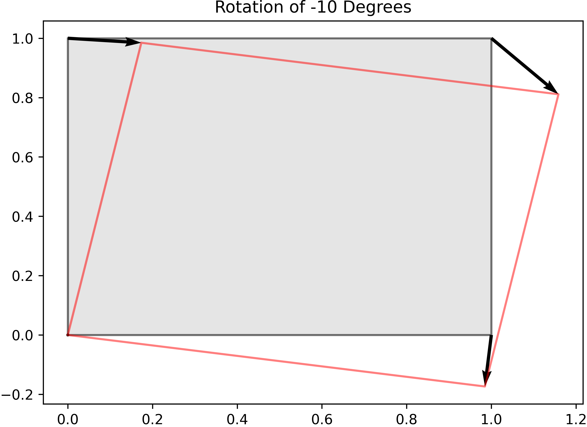
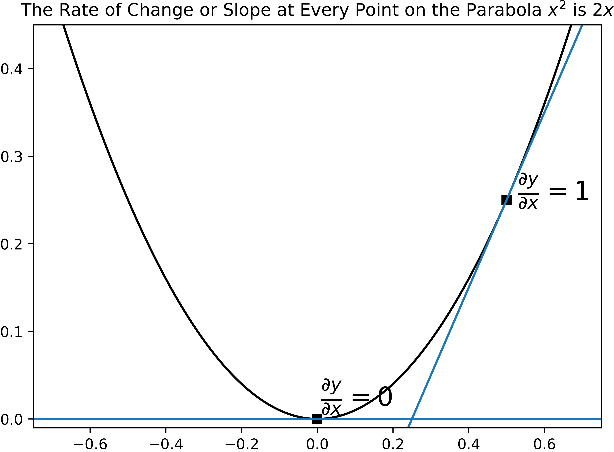
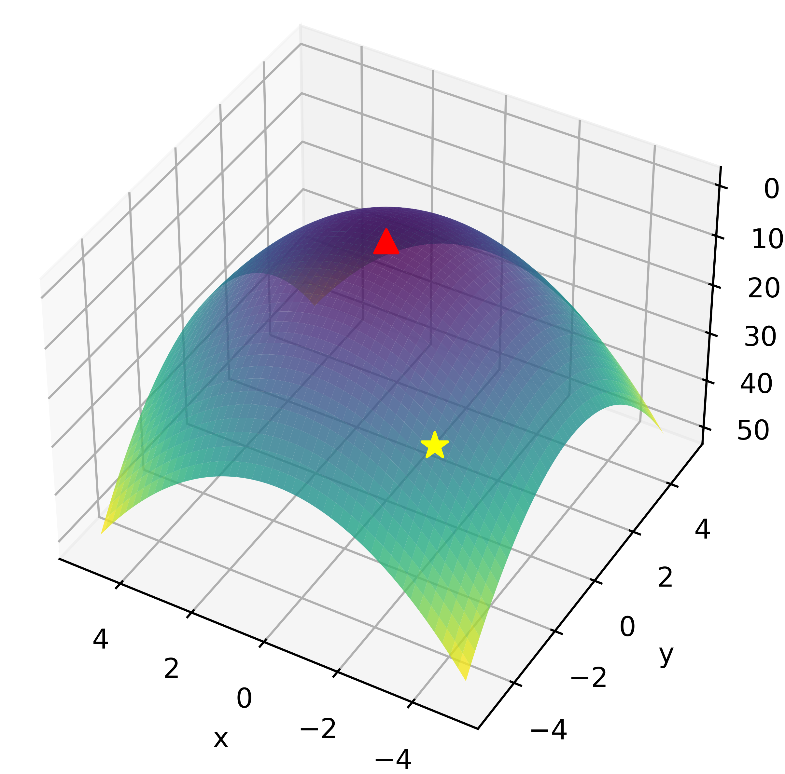
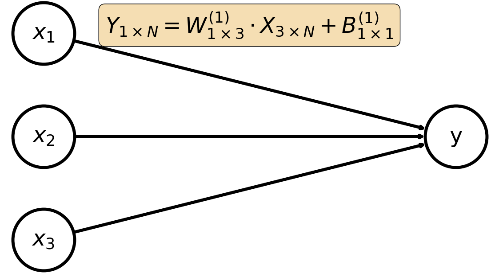
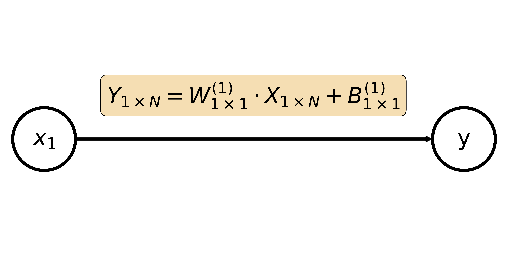
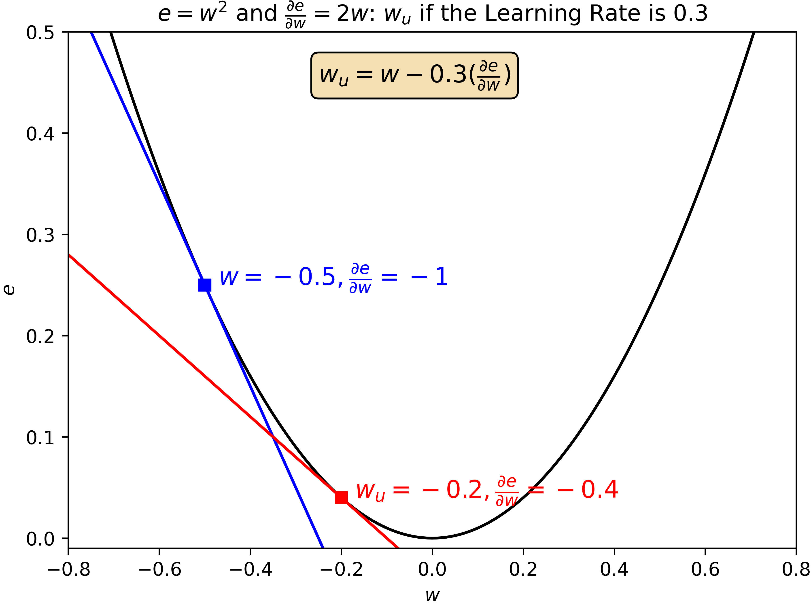

# Why Learn the Mathematics of Deep Learning?

<!--
- Beamer in R markdown:  https://bookdown.org/yihui/rmarkdown/beamer-presentation.html
- Beamer Theme Matrix:  https://mpetroff.net/files/beamer-theme-matrix/
-->

```{r rPrelims, eval = TRUE, echo = FALSE}
# Create a chunk option for setting the size of code.
def.chunk.hook  <- knitr::knit_hooks$get("chunk")
knitr::knit_hooks$set(chunk = function(x, options) {
    x <- def.chunk.hook(x, options)
    ifelse(options$size != "normalsize", paste0("\n \\", options$size,"\n\n", x, "\n\n \\normalsize"), x)
})
```

```{python pyPrelims, eval = TRUE, echo = FALSE}
import numpy as np
import matplotlib.pyplot as plt
from mpl_toolkits.mplot3d import Axes3D
from pathlib import Path
import math
import sympy as sym
import networkx as nx
import pandas as pd
from PIL import Image
from tensorflow.keras.datasets import mnist
```

\emph{\Large Learning the math behind a statistical method is like learning the secret to a magic trick.  Once you know the math, you can never be fooled by the same trick again.}

# 2024 Nobel Prize in Physics @nobel2024

```{r nobelImage, echo = FALSE, dpi = 550, fig.align = "center", results = 'asis'}
knitr::include_graphics("./images/nobel_nn.png", auto_pdf = TRUE)
```

# Applications to the Oversight Mission

- Each IG is responsible for the oversight of agencies that will implement deep learning to make more informed and better decisions, but come with risks such as bias, privacy, lack of transparency, and ethical complexities.
- Each OIG will use deep leaning to provide better oversight.
    - Auditors will use deep learning to write better recommendations based on data about how clients responded to previous recommendations.
    - Evaluators will use deep learning to find evidence of systemic problems in large volumes of data.
    - Investigators will use deep learning to find leads based on patterns observed their case data.
    
# The Deep in Deep Learning

- Deep learning always refers to deep neural networks.  
- A deep neural network is a neural network with more than two layers.
- ChatGPT Version 4 is reported to have 1.8 trillion parameters across 120 layers @gptleak!

<!--
- This presentation is deceptively named because for the sake of teaching I will focus on so-called Shallow Neural Networks with fewer than two layers.  However, the concepts herein extrapolate to Deep Neural Networks.
-->

# Preliminaries

- This presentation is aimed at the someone who wants to learn about deep learning without having a background in sophisticated mathematics.
- We briefly introduce some concepts from _linear algebra_ and _differential calculus_, but will focus on an intuitive understanding.

# Matricies

- A _matrix_ is a grid of numbers with $N$ rows and $P$ columns denoted $X_{N \times P}$.
    - $X_{2 \times 2} = \begin{bmatrix} x_1 & x_2 \\ x_3 & x_4 \end{bmatrix}$ is a $2 \times 2$ matrix.
    - $X_{1 \times 1} = \begin{bmatrix} x_1 \end{bmatrix}$ is a $1 \times 1$ matrix, also called a _scalar_.
    - $X_{1 \times 2} = \begin{bmatrix} x_1 & x_2 \end{bmatrix}$ is a $1 \times 2$ matrix, also called a _vector_.

# Matrix Translation

- _Matrix translation_ is the addition/subtraction of a constant to every element of a matrix.
    - The columns of $X_{2 \times 6} = \begin{bmatrix} 0 & 0 & 1 & 1 & 0 & 0 \\  0 & 1 & 1 & 0 & 0 & 1 \end{bmatrix}$ describe a square in 2-dimensional space.  We can translate the square by $0.2$ units by adding $0.2$ to each element of $X_{2 \times 6}$.

```{python matrixTranslation, eval = TRUE, echo = FALSE}
X = np.array([[0, 0, 1, 1, 0, 0], [0, 1, 1, 0, 0, 1]])
B = np.array([0.2])
Ztrans = X + B
Z = Ztrans - X

translation = Path("./images/translation.png")

if not translation.is_file():
    plt.clf()
    _ = plt.title("Translation of 0.2 Units")
    _ = plt.plot(X[0, :], X[1, :], color = "black", alpha = 0.5)
    _ = plt.plot(Ztrans[0, :], Ztrans[1, :], color = "red", alpha = 0.5)
    _ = plt.fill_between(X[1, :], X[0, :], color = "black", alpha = 0.1)
    _ = plt.quiver(*X[:, 0], Z[0, 0], Z[1, 0], angles='xy', scale_units='xy', scale=1., color="black", width = 0.006, alpha = 1)
    _ = plt.quiver(*X[:, 1], Z[0, 1], Z[1,1], angles='xy', scale_units='xy', scale=1., color="black", width = 0.006, alpha = 1)
    _ = plt.quiver(*X[:, 2], Z[0, 2], Z[1, 2], angles='xy', scale_units='xy', scale=1., color="black", width = 0.006, alpha = 1)
    _ = plt.quiver(*X[:, 3], Z[0, 3], Z[1, 3], angles='xy', scale_units='xy', scale=1., color="black", width = 0.006, alpha = 1)
    _ = plt.gcf().set_size_inches(7, 5)
    _ = plt.savefig("./images/translation.png", bbox_inches = "tight", pad_inches= 0, dpi = 550)
    plt.close("all")
```

```{r translationImage, echo = FALSE, fig.align = "center", dpi = 1200}

```

# Matrix Transformation

- _Matrix transformation_ is achieved through the matrix-specific operation called the _dot product_ where the rows of $X$ and the columns of $Y$ are multiplied and summed.
    - The dot product of $X_{1 \times 2} \cdot Y_{2 \times 1} = \begin{bmatrix} x_1 & x_2 \end{bmatrix} \cdot \begin{bmatrix} y_1 \\ y_2 \end{bmatrix} = \begin{bmatrix} x_1 y_1 + x_2 y_2 \end{bmatrix}$
    - If the number of columns in $X$ does not equal the number of rows in $Y$ then the dot product operation is not defined.
    - The size of the resulting matrix is equal to the number of rows in $X$ and the number of columns in $Y$.

# Matrix Transformation:  Scale

- $X_{2 \times 6}$ can be scaled by $50\%$ taking the dot product of $\begin{bmatrix} 0.5 & 0 \\ 0 & 0.5 \end{bmatrix}$ and $X_{2 \times 6}$.

```{python matrixScale, eval = TRUE, echo = FALSE}
X = np.array([[0, 0, 1, 1, 0, 0], [0, 1, 1, 0, 0, 1]])
B = np.array([0.5])
W = np.array([
    [0.5, 0],
    [0,  0.5]
])
Zscale = np.dot(W, X)
Z = Zscale - X

scale = Path("./mathematics_of_nn/images/scale.png")

if not scale.is_file():
    plt.clf()
    _ = plt.title("50% Scale")
    _ = plt.plot(X[0, :], X[1, :], color = "black", alpha = 0.5)
    _ = plt.plot(Zscale[0, :], Zscale[1, :], color = "red", alpha = 0.5)
    _ = plt.fill_between(X[1, :], X[0, :], color = "black", alpha = 0.1)
    _ = plt.quiver(*X[:, 0], Z[0, 0], Z[1, 0], angles='xy', scale_units='xy', scale=1., color="black", width = 0.006, alpha = 1)
    _ = plt.quiver(*X[:, 1], Z[0, 1], Z[1, 1], angles='xy', scale_units='xy', scale=1., color="black", width = 0.006, alpha = 1)
    _ = plt.quiver(*X[:, 2], Z[0, 2], Z[1, 2], angles='xy', scale_units='xy', scale=1., color="black", width = 0.006, alpha = 1)
    _ = plt.quiver(*X[:, 3], Z[0, 3], Z[1, 3], angles='xy', scale_units='xy', scale=1., color="black", width = 0.006, alpha = 1)
    _ = plt.gcf().set_size_inches(7, 5)
    _ = plt.savefig("./images/scale.png", bbox_inches = "tight", pad_inches= 0, dpi = 600)
    plt.close("all")
```

```{r scaleImage, echo = FALSE, fig.align = "center", dpi = 1200}

```

# Matrix Transformation:  Rotation

- $X_{2 \times 6}$ can be rotated by negative 10 degrees by taking the dot product of $\begin{bmatrix} cos(0.175) & -sin(0.175) \\ sin(0.175) & cos(0.175) \end{bmatrix}$ and $X_{2 \times 6}$.

```{python matrixRotation, eval = TRUE, echo = FALSE}
X = np.array([[0, 0, 1, 1, 0, 0], [0, 1, 1, 0, 0, 1]])
theta = math.radians(-10)
W = np.array([
    [math.cos(theta), -math.sin(theta)],
    [math.sin(theta), math.cos(theta)]
])
Zrot = np.dot(W, X)
Z = Zrot - X

rotation = Path("./images/rotation.png")

if not rotation.is_file():
    plt.clf()
    _ = plt.title("Rotation of -10 Degrees")
    _ = plt.plot(X[0, :], X[1, :], color = "black", alpha = 0.5)
    _ = plt.plot(Zrot[0, :], Zrot[1, :], color = "red", alpha = 0.5)
    _ = plt.fill_between(X[1, :], X[0, :], color = "black", alpha = 0.1)
    _ = plt.quiver(*X[:, 0], Z[0, 0], Z[1, 0], angles='xy', scale_units='xy', scale=1., color="black", width = 0.006, alpha = 1)
    _ = plt.quiver(*X[:, 1], Z[0, 1], Z[1, 1], angles='xy', scale_units='xy', scale=1., color="black", width = 0.006, alpha = 1)
    _ = plt.quiver(*X[:, 2], Z[0, 2], Z[1, 2], angles='xy', scale_units='xy', scale=1., color="black", width = 0.006, alpha = 1)
    _ = plt.quiver(*X[:, 3], Z[0, 3], Z[1, 3], angles='xy', scale_units='xy', scale=1., color="black", width = 0.006, alpha = 1)
    _ = plt.gcf().set_size_inches(7, 5)
    _ = plt.savefig("./images/rotation.png", bbox_inches = "tight", pad_inches= 0, dpi = 600)
    plt.close("all")
```

```{r rotationImage, echo = FALSE, fig.align = "center", dpi = 1200}

```

<!--
- A "radian" and a "degree" are both units used to measure angles, but a radian is defined based on the ratio of an arc length to the radius of a circle, while a degree is one of 360 equal parts of a full circle.
-->

# Matris Transformation:  Affine

- An affine transformation of $X_{2 \times 6}$ combines transformation and translation.  For example, combining the rotation transformation of $-10$ degrees and translation of $0.2$ units.

```{python matrixAffine, eval = TRUE, echo = FALSE}
X = np.array([[0, 0, 1, 1, 0, 0], [0, 1, 1, 0, 0, 1]])
B = np.array([[0.2], [-0.2]])
theta = math.radians(-10)
W = np.array([
    [math.cos(theta), -math.sin(theta)],
    [math.sin(theta), math.cos(theta)]
])
Zaffine = np.dot(W, X) + B
Z = Zaffine - X

affine = Path("./images/affine.png")

if not affine.is_file():
    plt.clf()
    _ = plt.title("Affine Transformation")
    _ = plt.plot(X[0, :], X[1, :], color = "black", alpha = 0.5)
    _ = plt.plot(Zaffine[0, :], Zaffine[1, :], color = "red", alpha = 0.5)
    _ = plt.fill_between(X[1, :], X[0, :], color = "black", alpha = 0.1)
    _ = plt.quiver(*X[:, 0], Z[0, 0], Z[1, 0], angles='xy', scale_units='xy', scale=1., color="black", width = 0.006, alpha = 1)
    _ = plt.quiver(*X[:, 1], Z[0, 1], Z[1, 1], angles='xy', scale_units='xy', scale=1., color="black", width = 0.006, alpha = 1)
    _ = plt.quiver(*X[:, 2], Z[0, 2], Z[1, 2], angles='xy', scale_units='xy', scale=1., color="black", width = 0.006, alpha = 1)
    _ = plt.quiver(*X[:, 3], Z[0, 3], Z[1, 3], angles='xy', scale_units='xy', scale=1., color="black", width = 0.006, alpha = 1)
    _ = plt.gcf().set_size_inches(7, 5)
    _ = plt.savefig("./images/affine.png", bbox_inches = "tight", pad_inches= 0, dpi = 600)
    plt.close("all")
```

```{r affineImage, echo = FALSE, fig.align = "center", dpi = 1200}

```

# Rate of Change:  The Derivative

- A _derivative_ measures the rate of change or slope at any point denoted by $\frac{\partial y}{\partial x}$, which is read "the change in $y$ with respect to the change in $x$."

```{python derivative, eval = TRUE, echo = FALSE}
x = sym.symbols("x")
y = (x)**2
dy = sym.diff(y, x)

x_num = np.linspace(-1, 1, 1001)

y_f = sym.lambdify(x, y, "numpy")
y_num = y_f(np.linspace(-1, 1, 1001))

dy_f = sym.lambdify(x, dy, "numpy")
dy_num = dy_f(np.linspace(-1, 1, 1001))

derivative = Path("./images/derivative.png")

if not derivative.is_file():
    plt.clf()
    _ = plt.title("The Rate of Change or Slope at Every Point on the Parabola $x^2$ is $2x$")
    _ = plt.axis((-0.75, 0.75, -0.01, 0.45))
    _ = plt.plot(x_num, y_num, color = "black")
    _ = plt.plot(0.5, y_f(0.5), "s", color = "black")
    _ = plt.plot(0, y_f(0), "s", color = "black")
    _ = plt.axline((0, y_f(0)), slope = dy_f(0))
    _ = plt.axline((0.5, y_f(0.5)), slope = dy_f(0.5))
    _ = plt.annotate("$\\frac{\\partial y}{\\partial x} = 1$", (0.5 + 0.03, y_f(0.5)), size = 18)
    _ = plt.annotate("$\\frac{\\partial y}{\\partial x} = 0$", (0 + 0.01, y_f(0) + 0.015), size = 18)
    _ = plt.gcf().set_size_inches(7, 5)
    _ = plt.savefig("./images/derivative.png", bbox_inches = "tight", pad_inches= 0, dpi = 600)
    plt.close("all")
```

```{r derivativeImage, echo = FALSE, fig.align = "center", dpi = 1100}

```

<!--
- I am going to spare you the details of how to take a derivative because it's the intuitive piece that matters.
- The derivative is the slope of the line that just touch the point, also called a tangent line.  
- The plot shows the derivative of the parabola at (0.5, 0.25) and (0,0).
    - The rate or change or slope of the line at (0.5, 0.25) is 1.
    - The rate or change or slope of the line at (0,0) is 0, which is the minimum of the parabola.
-->

# Rate of Change: The Gradient

- The _gradient_ is a generalization of the derivative that measures the rate of change or slope in every direction.  For example, if we have the surface $z = x^2 + y^2$ the slope in the $x$ direction is $\frac{\partial z}{\partial x} = 2x$ and the slope in the $y$ direction is $\frac{\partial z}{\partial y} = 2y$.

```{python gradient, eval = TRUE, echo = FALSE}
x, y = sym.symbols('x y')

z = x**2 + y**2
z_f = sym.lambdify((x, y), z, "numpy")
z_num = z_f(np.linspace(-5, 5, 1001), np.linspace(-5, 5, 1001))

dzx = sym.diff(z, x)
dzx_f = sym.lambdify(x, dzx, "numpy")
dzx_num = dzx_f(np.linspace(-5, 5, 1001))

dzy = sym.diff(z, y)
dzy_f = sym.lambdify(y, dzy, "numpy")
dzy_num = dzy_f(np.linspace(-5, 5, 1001))

x_num, y_num = np.meshgrid(np.linspace(-5, 5, 1001), np.linspace(-5, 5, 1001))
z_num = x_num**2 + y_num**2

gradient = Path("./images/gradient.png")

if not gradient.is_file():
    plt.clf()
    fig = plt.figure()
    ax = fig.add_subplot(111, projection='3d', computed_zorder=False)
    _ = ax.plot_surface(x_num, y_num, z_num, cmap=plt.cm.viridis, linewidth=0, antialiased=True, alpha = 0.8)
    _ = ax.view_init(-140, 60)
    _ = ax.scatter(0, 0, 0, c='red', s=75, marker = "^")
    _ = ax.scatter(-3, -3, 18, c='yellow', s=100, marker = "*")
    _ = ax.set_xlabel('x')
    _ = ax.set_ylabel('y')
    _ = ax.set_zlabel('z')
    _ = plt.gcf().set_size_inches(7, 5)
    _ = plt.savefig("./images/gradient.png", bbox_inches = "tight", pad_inches= 0, dpi = 600)
    plt.close("all")
```

```{r gradientImage, echo = FALSE, fig.align = "center", dpi = 1100}

```

<!--
- Imagine climbing a hill at the yellow star.
    - There is the slope going up the hill which is the slope in the y-direction.
    - There is the slope going side-to-side on the hill which is the slope in the x-direction
- At the top of the hill, the gradient is zero because there is no more up-down or side-to-side change.
-->

# Deep Learning Intuition I

- A neural network is an information sieve that takes as input the outcomes, and the features we want to use to predict the outcomes @chollet2021deep.
- At the top of the sieve is the most granular representation of the data, and for each successive layer down, the data becomes more and more refined, that is, better at predicting the outcome @chollet2021deep.

```{r sieve, echo = FALSE, dpi = 300, fig.align = "center", results = 'asis'}
knitr::include_graphics("./images/sieve.png", auto_pdf = TRUE)
```

# Deep Learning Intuition II

- Consider a blue and red piece of paper crumpled together and your goal is to uncrumple them.  Each movement of your fingers to uncrumple the papers is like a layer of a neural network, until finally at the last layer the colors are fully separated @chollet2021deep.

```{r paper, echo = FALSE, dpi = 400, fig.align = "center", results = 'asis'}
knitr::include_graphics("./images/paper.PNG", auto_pdf = TRUE)
```

# Deep Learning Roadmap:  Layers

- The full process of fitting a neural network is shown below.  As a first step, we will explain the mathematical representation of the layers @chollet2021deep.

```{r deepLearningLayers, echo = FALSE, dpi = 400, fig.align = "center", results = 'asis'}
knitr::include_graphics("./images/deep_learning_layers.PNG", auto_pdf = TRUE)
```

<!--
- This is called a shallow neural network because it has only two layers.  A neural network is said to be _deep_ if is has more than two layers @berner2021modern.
-->

# Representation of a Single-Layer Neural Network

- A single layer neural network is represented by the affine transformation $Y = W \cdot X + B$ @berner2021modern.

```{python singleLayer, eval = TRUE, echo = FALSE}
G = nx.DiGraph([("$x_3$", "y"), ("$x_2$", "y"), ("$x_1$", "y")])
left_nodes = ["$x_3$", "$x_2$", "$x_1$"]
right_nodes = ["y"]

pos = {n: (0, i) for i, n in enumerate(left_nodes)}
pos.update({n: (2, i + 1) for i, n in enumerate(right_nodes)})

options = {
    "font_size": 36,
    "node_size": 10000,
    "node_color": "white",
    "edgecolors": "black",
    "linewidths": 5,
    "width": 5,
}

one_layer = Path("./images/one_layer.png")

if not one_layer.is_file():
    plt.clf()
    _ = plt.figure(figsize = (14.5, 8))
    _ = nx.draw_networkx(G, pos, **options)
    _ = plt.margins(0.05, 0.1)
    _ = plt.axis("off")
    _ = plt.text(0.3, 2, "$Y_{1 \\times N} = W^{(1)}_{1 \\times 3} \\cdot X_{3 \\times N} + B^{(1)}_{1 \\times 1}$", fontsize = 35, bbox = dict(boxstyle='round', facecolor='wheat', alpha=1))
    _ = plt.savefig("./images/one_layer.png", bbox_inches = "tight", pad_inches= 0)
    plt.close("all")
```

```{r oneLayerImage, echo = FALSE, fig.align = "center", dpi = 400}

```

# Representation of a Two-Layer Neural Network

- A two layer neural network includes a layer of _neurons_ between the features and the outcome.  These are called _hidden neurons_ because they are not observed in the input data @berner2021modern.

```{python twoLayer, eval = TRUE, echo = FALSE}
G = nx.DiGraph([
    ("$x_3$", "$h_1$"), ("$x_3$", "$h_2$"), ("$x_3$", "$h_3$"), ("$x_3$", "$h_4$"),
    ("$x_2$", "$h_1$"), ("$x_2$", "$h_2$"), ("$x_2$", "$h_3$"), ("$x_2$", "$h_4$"),
    ("$x_1$", "$h_1$"), ("$x_1$", "$h_2$"), ("$x_1$", "$h_3$"), ("$x_1$", "$h_4$"),
    ("$h_1$", "$\\varrho(h_1)$"), ("$h_2$", "$\\varrho(h_2)$"), ("$h_3$", "$\\varrho(h_3)$"), ("$h_4$", "$\\varrho(h_4)$"),
    ("$\\varrho(h_1)$", "y"), ("$\\varrho(h_2)$", "y"), ("$\\varrho(h_3)$", "y"), ("$\\varrho(h_4)$", "y")
])
left_nodes = ["$x_3$", "$x_2$", "$x_1$"]
middle_nodes_1 = ["$h_4$", "$h_3$", "$h_2$", "$h_1$"]
middle_nodes_2 = ["$\\varrho(h_4)$", "$\\varrho(h_3)$", "$\\varrho(h_2)$", "$\\varrho(h_1)$"]
right_nodes = ["y"]

pos = {n: (0, i + 0.5) for i, n in enumerate(left_nodes)}
pos.update({n: (1.2, i) for i, n in enumerate(middle_nodes_1)})
pos.update({n: (1.5, i) for i, n in enumerate(middle_nodes_2)})
pos.update({n: (2.8, i + 1.5) for i, n in enumerate(right_nodes)})

options = {
    "font_size": 36,
    "node_size": 10000,
    "node_color": "white",
    "edgecolors": "black",
    "linewidths": 5,
    "width": 5,
}

two_layer = Path("./images/two_layer.png")

if not two_layer.is_file():
    plt.clf()
    _ = plt.figure(figsize = (29, 12))
    _ = nx.draw_networkx(G, pos, **options)
    _ = plt.margins(0, 0.09)
    _ = plt.axis("off")
    _ = plt.text(0.01, 3.1, "$h^{(1)}_{4 \\times N} = W^{(1)}_{4 \\times 3} \\cdot X_{3 \\times N} + B^{(1)}_{1 \\times 4}$", fontsize = 40, bbox = dict(boxstyle='round', facecolor='wheat', alpha=1))
    _ = plt.text(1.65, 3.1, "$Y_{1 \\times N} = W^{(2)}_{1 \\times 4} \\cdot \\varrho(h^{(1)}_{4 \\times N}) + B^{(2)}_{1 \\times 1}$", fontsize = 40, bbox = dict(boxstyle='round', facecolor='wheat', alpha=1))
    _ = plt.savefig("./images/two_layer.png", bbox_inches = "tight", pad_inches= 0)
plt.close("all")
```

```{r twoLayerImage, echo = FALSE, fig.align = "left", dpi = 520}

```

# What Is $\varrho(h)$ and Why Do We Need It?

- The function $\varrho(h)$ is a non-linear transformation applied to the otherwise linear affine transformation, also called an _activation function_ @berner2021modern.
- A two-layer neural network without a non-linear transformation between layers is a single-layer neural network in disguise @chollet2021deep!

\begin{equation*}
\begin{split}
Y_{1 \times N} = \\ 
W^{(2)}_{1 \times 4} \cdot h^{(1)}_{4 \times N} + B^{(2)}_{1 \times 1} = \\
W^{(2)}_{1 \times 4} \cdot (W^{(1)}_{4 \times 3} \cdot X_{3 \times N} + B^{(1)}_{1 \times 4}) + B^{(2)}_{1 \times 1} = \\
(W^{(2)}_{1 \times 4} \cdot W^{(1)}_{4 \times 3}) \cdot X_{3 \times N} + (W^{(2)}_{1 \times 4} B^{(1)}_{1 \times 4} + B^{(2)}_{1 \times 1})
\end{split}
\end{equation*}

# Rectified Linear Unit (ReLU)

- A common $\varrho(h)$ is the _ReLU_ transformation which replaces all negative values with 0 @berner2021modern.

```{python matrixRelu, eval = TRUE, echo = FALSE}
X = np.array([[0, 0, 1, 1, 0, 0], [0, 1, 1, 0, 0, 1]])
B = np.array([[0.2], [-0.2]])
theta = math.radians(-10)
W = np.array([
    [math.cos(theta), -math.sin(theta)],
    [math.sin(theta), math.cos(theta)]
])
Zaffine = np.dot(W, X) + B
Zaffine[Zaffine < 0] = 0

Z = Zaffine - X

relu = Path("./images/relu.png")

if not affine.is_file():
    plt.clf()
    _ = plt.title("ReLU Transformation")
    _ = plt.plot(X[0, :], X[1, :], color = "black", alpha = 0.5)
    _ = plt.plot(Zaffine[0, :], Zaffine[1, :], color = "red", alpha = 0.5)
    _ = plt.fill_between(X[1, :], X[0, :], color = "black", alpha = 0.1)
    _ = plt.quiver(*X[:, 0], Z[0, 0], Z[1, 0], angles='xy', scale_units='xy', scale=1., color="black", width = 0.006, alpha = 1)
    _ = plt.quiver(*X[:, 1], Z[0, 1], Z[1, 1], angles='xy', scale_units='xy', scale=1., color="black", width = 0.006, alpha = 1)
    _ = plt.quiver(*X[:, 2], Z[0, 2], Z[1, 2], angles='xy', scale_units='xy', scale=1., color="black", width = 0.006, alpha = 1)
    _ = plt.quiver(*X[:, 3], Z[0, 3], Z[1, 3], angles='xy', scale_units='xy', scale=1., color="black", width = 0.006, alpha = 1)
    _ = plt.gcf().set_size_inches(7, 5)
    _ = plt.savefig("./images/relu.png", bbox_inches = "tight", pad_inches= 0, dpi = 600)
    plt.close("all")
```

```{r reluImage, echo = FALSE, fig.align = "center", dpi = 1200}

```

# Deep Learning Roadmap:  Loss

- After a neural network is fit, we need a way to measure how good it is at predicting the outcome of interest.  This is called the _loss function_ @chollet2021deep.

```{r deepLearningLoss, echo = FALSE, dpi = 400, fig.align = "center", results = 'asis'}
knitr::include_graphics("./images/deep_learning_loss.PNG", auto_pdf = TRUE)
```

# Measures of Loss

- For a numeric outcome a common measure of loss is the _mean squared error_, which measures the average of the squared deviations from the observed outcomes and our predictions of them @fox2008applied.

\begin{equation*}
e = \frac{1}{n}\sum_{i=1}^{n}(y - y^{\prime})^2
\end{equation*}

- There are many other measure of loss, such as _categorical cross entropy_, which can be used to measure loss when the outcome is categorical @chollet2021deep.

# Forward Pass I

- Consider the most basic of neural networks, a single feature used to predict a single outcome.
- The _forward pass_ calculates the predictions of the outcome from the input data using the values of $W$ and $B$ @chollet2021deep.

```{python simplenn, eval = TRUE, echo = FALSE}
G = nx.DiGraph([("$x_1$", "y")])
left_nodes = ["$x_1$"]
right_nodes = ["y"]

pos = {n: (0, i) for i, n in enumerate(left_nodes)}
pos.update({n: (2, i) for i, n in enumerate(right_nodes)})

options = {
    "font_size": 36,
    "node_size": 10000,
    "node_color": "white",
    "edgecolors": "black",
    "linewidths": 5,
    "width": 5,
}

simple_nn = Path("./images/simple_nn.png")

if not one_layer.is_file():
    plt.clf()
    _ = plt.figure(figsize = (14.5, 8))
    _ = nx.draw_networkx(G, pos, **options)
    _ = plt.margins(0.05, 0.1)
    _ = plt.axis("off")
    _ = plt.text(0.3, 0.001, "$Y_{1 \\times N} = W^{(1)}_{1 \\times 1} \\cdot X_{1 \\times N} + B^{(1)}_{1 \\times 1}$", fontsize = 35, bbox = dict(boxstyle = "round", facecolor = "wheat", alpha=1))
    _ = plt.savefig("./images/simple_nn.png", bbox_inches = "tight", pad_inches= 0, dpi = 600)
    plt.close("all")
```

```{r simplennImage, echo = FALSE, fig.align = "center", dpi = 1700}

```

# Forward Pass II

- Let $Y = \begin{bmatrix} 0.2 & 0.25 & 0.4 & 0.7 \end{bmatrix}$, $X = \begin{bmatrix} 0.1 & 0.3 & 0.6 & 0.7 \end{bmatrix}$,  $W = \begin{bmatrix} 0.5 \end{bmatrix}$, $B = \begin{bmatrix} 0 \end{bmatrix}$.
- The initial predictions from the first forward pass are $Y^{\prime} = W \cdot X + B = \begin{bmatrix} 0.5 \end{bmatrix} \cdot \begin{bmatrix} 0.2 & 0.25 & 0.4 & 0.7 \end{bmatrix} + \begin{bmatrix} 0 \end{bmatrix} = \begin{bmatrix} 0.05 & 0.15 & 0.3 & 0.35 \end{bmatrix}$.
- The calculated loss using the MSE is $e = \frac{1}{4}((0.2 - 0.05)^2 + (0.25 - 0.15)^2 + (0.4 - 0.3)^2 + (0.7 - 0.35)^2) = 0.0412$.

# Forward Pass III

```{python forwardp, eval = TRUE, echo = FALSE, results = FALSE}
Y = np.array([[0.2, 0.25, 0.4, 0.7]])
X = np.array([[0.1, 0.3, 0.6, 0.7]])
W = np.array([[0.5]])
B = np.array([[0]])

Y_pred = np.dot(W, X) + B

e = 0.25*(((Y-Y_pred)**2).sum())

forwardp = Path("./images/forwardp.png")

if not forwardp.is_file():
    plt.clf()
    _ = plt.figure(figsize = (5, 3))
    _ = plt.scatter(X, Y)
    _ = plt.axline((0, B[0][0]), slope = W[0][0], color = "red")
    _ = plt.text(0.2, 0.05, "$Y = 0.5X + 0$", fontsize = 12)
    _ = plt.title(f"MSE After the First Forward Pass: {round(e, 4)}")
    _ = plt.savefig("./images/forwardp.png", bbox_inches = "tight", pad_inches= 0, dpi = 600)
    plt.close("all")
```

```{r forwardpImage, echo = FALSE, fig.align = "center", dpi = 600}

```

<!--
- Example from:  https://towardsdatascience.com/training-a-neural-network-by-hand-1bcac4d82a6e.
- I hear in my mind from everyone who has taken Calculus:  You don't have to do this numerically, just take the derivative of the loss function, set it equal to zero, and solve!  While straw man in my mind is correct in this very simple example, for more complicated neural networks, analytic solutions are not forthcoming.
- Obviously this isn't a great fit because we randomly choose the values of W and B, so next we will discuss how to update them to make the model fit better!
-->

# Deep Learning Roadmap:  Optimization

- The optimization step has the goal of _learning_ the values of $W$ and $B$ that minimize the MSE @chollet2021deep.

```{r deepLearningOptimizer, echo = FALSE, dpi = 400, fig.align = "center", results = 'asis'}
knitr::include_graphics("./images/deep_learning_optimizer.PNG", auto_pdf = TRUE)
```

# Gradient Descent I

- Optimization is done numerically through an algorithm called _gradient descent_.
- Gradient descent works by stepping down a function in the opposite direction of the gradient @gradient_descent.

```{python gradientDescent, eval = TRUE, echo = FALSE, results = FALSE}
image = Image.open("./images/gradient_descent.png")

gradient_descent_title = Path("./images/gradient_descent_title.png")

if not gradient_descent_title.is_file():
    plt.clf()
    fig, ax = plt.subplots(figsize=(14, 4))
    _ = plt.imshow(image)
    _ = plt.gca().spines['top'].set_visible(False)
    _ = plt.gca().spines['right'].set_visible(False)
    _ = plt.gca().spines['bottom'].set_visible(False)
    _ = plt.gca().spines['left'].set_visible(False)
    _ = plt.xticks([])
    _ = plt.yticks([])
    _ = plt.title("The Gradient Descent Algorithm to Find the Minimum of a Parabola")
    _ = plt.xlabel("$w$")
    _ = plt.ylabel("$e$")
    _ = plt.savefig("./images/gradient_descent_title.png", bbox_inches = "tight", pad_inches= 0, dpi = 600)
    plt.close("all")
```

```{r gradientDescentTitleImage, echo = FALSE, dpi = 950, fig.align = "center", results = 'asis'}
knitr::include_graphics("./images/gradient_descent_title.png", auto_pdf = TRUE)
```

# Gradient Descent II

- In general, if we move $w$ and $b$ in the opposite direction of the gradient $\frac{\partial e}{\partial w}$ and $\frac{\partial e}{\partial b}$, then the MSE will decrease @chollet2021deep.
    - The updated value of $w$ is $w_u = w - \alpha(\frac{\partial e}{\partial w})$.
    - The updated value of $b$ is $b_u = b - \alpha(\frac{\partial e}{\partial b})$.

```{python updatew, eval = TRUE, echo = FALSE, results = FALSE}
x = sym.symbols("x")
y = x**2
dy = sym.diff(y, x)

x_f = sym.lambdify(x, x, "numpy")
x_num = x_f(np.linspace(-5, 5, 1001))

y_f = sym.lambdify(x, y, "numpy")
y_num = y_f(np.linspace(-5, 5, 1001))

dy_f = sym.lambdify(x, dy, "numpy")
dy_num = dy_f(np.linspace(-5, 5, 1001))

updatew = Path("./images/updatew.png")

if not updatew.is_file():
    plt.clf()
    _ = plt.title("$e = w^2$ and $\\frac{\partial e}{\partial w} = 2w$: $w_{u}$ if the Learning Rate is 0.3")
    _ = plt.axis((-0.8, 0.8, -0.01, 0.5))
    _ = plt.plot(x_num, y_num, color = "black")
    _ = plt.axline((-0.5, y_f(-0.5)), slope = dy_f(-0.5), color = "blue")
    _ = plt.axline((-0.2, y_f(-0.2)), slope = dy_f(-0.2), color = "red")
    _ = plt.plot(-0.5, y_f(-0.5), "s", color = "blue")
    _ = plt.plot(-0.2, y_f(-0.2), "s", color = "red")
    _ = plt.annotate("$w = -0.5, \\frac{\\partial e}{\\partial w} = -1$", (-0.5 + 0.03, y_f(-0.5)), size = 13, color = "blue")
    _ = plt.annotate("$w_{u} = -0.2, \\frac{\\partial e}{\\partial w} = -0.4$", (-0.2 + 0.03, y_f(-0.2)), size = 13, color = "red")
    _ = plt.text(-0.25, 0.45, "$w_{u} = w - 0.3(\\frac{\\partial e}{\\partial w})$", fontsize = 13, bbox = dict(boxstyle='round', facecolor='wheat', alpha=1))
    _ = plt.xlabel("$w$")
    _ = plt.ylabel("$e$")
    _ = plt.gcf().set_size_inches(7, 5)
    _ = plt.savefig("./images/updatew.png", bbox_inches = "tight", pad_inches= 0, dpi = 600)
    plt.close("all")
```

```{r updatewImage, echo = FALSE, fig.align = "center", dpi = 1200}

```

<!--
- In this example, our initial value of W is -0.5, and at this point the rate of change is -1.  After updating W, the new value is -0.2, and at this point the rate of change is -0.4.
- This step-down behavior is characteristic of a gradient descent algorithm.
- Alpha is the learning rate.  In more complex cases where there may be many minimums, setting this parameter can prevent the algorithm from getting stuck at a local minimum instead of the absolute minimum.
-->

# A Note About Calculating Gradients

- In the previous slides we made the assumption that calculating the gradient of a loss function is easy, but for neural networks with many layers and thousands of parameters, this is not true.
- The problem of efficiently calculating the gradient is solved using _backpropagation_.
    - Backpropagation works by chaining together the gradients of very simple expressions that are part of the computation graph of a neural network to calculate the otherwise very complicated gradient for the entire neural network.
    - All of the individual gradients taken together have the appearance of being taped together across the computation graph of a neural network, which is why backpropagation is sometimes called _gradient tape_.

<!--
- Backpropagation is an elegant solution to a difficult problem that deserves more attentions than this.  We will likely have a follow-on to this presentation that is devoted to this methdo.

- If we have two functions $f(x)$ and $g(x)$ and we want to calculate $\frac{\partial f(g(x))}{\partial x}$ the chain rule states $\frac{\partial f(g(x))}{\partial x} = \frac{\partial f(x)}{\partial g(x)} * \frac{\partial g(x)}{\partial x}$.
- If we have three functions $f(x)$, $g(x)$, $h(x)$ and we want to calculate $\frac{\partial f(g(h(x)))}{\partial x}$ the chain rules statues that $\frac{\partial f(g(h(x)))}{\partial x} = \frac{\partial f(x)}{\partial g(x)} * \frac{\partial g(x)}{\partial h(x)} * \frac{\partial h(x)}{\partial x}$.
- If we have four functions $f(x)$, $g(x)$, $h(x)$, $j(x)$ and we want to calculate $\frac{\partial f(g(h(j(x))))}{\partial x}$ the chain rule states $\frac{\partial f(g(h(j(x))))}{\partial x} = \frac{\partial f(x)}{\partial g(x)} * \frac{\partial g(x)}{\partial h(x)} * \frac{\partial h(x)}{\partial j(x)} * \frac{\partial j(x)}{\partial x}$.
-->

# Backward Pass

- Adjusting the values of $W$ and $B$ using gradient descent is called is called a _backward pass_ @chollet2021deep.
- Each cycle of a forward pass followed by a backward pass is called an _epoch_ @chollet2021deep.

```{python backwardPass, eval = TRUE, echo = FALSE, results = FALSE}
def Merge(dict1, dict2):
    res = {**dict1, **dict2}
    return res

class GradientDescent:
    def __init__(self, lr, x, y):
        self.lr = lr
        self.x = x
        self.y = y
        
        x1, x2, x3, x4 = sym.symbols('x1 x2 x3 x4')
        X = sym.Matrix([[x1, x2, x3, x4]])
        
        y1, y2, y3, y4 = sym.symbols('y1 y2 y3 y4')
        Y = sym.Matrix([[y1, y2, y3, y4]])
        
        w = sym.symbols('w')
        W = sym.Matrix([[w]])
        
        b = sym.symbols('b')
        B = sym.Matrix([[b, b, b, b]])
        
        K = (Y - (W*X + B))
        K_diag = sym.diag(K[0], K[1], K[2], K[3])
        
        self.MSE = ((0.25*(K*K_diag))*(sym.ones(1, 4)).T)[0]
        self.dW = 0.25*self.MSE.diff(w)
        self.dB = 0.25*self.MSE.diff(b)
        self.Wu = W[0] - self.lr*self.dW
        self.Bu = B[0] - self.lr*self.dB
        
    def values(self, w, b):
        vals = Merge(self.x, self.y)
        vals["w"] = w
        vals["b"] = b
        
        MSE = float(self.MSE.subs(vals))
        dW = float(self.dW.subs(vals))
        dB = float(self.dB.subs(vals))
        Wu = float(self.Wu.subs(vals))
        Bu = float(self.Bu.subs(vals))
        
        return({"MSE": MSE, "dW": dW, "dB": dB, "Wu": Wu, "Bu": Bu})
        
    def backward_pass(self, w, b):
        dfs = []
        ru = self.values(w, b)
        dfs.append(pd.DataFrame(ru, index = [1]))
        
        for i in range(100):
            ru = self.values(ru["Wu"], ru["Bu"])
            dfs.append(pd.DataFrame(ru, index = [1]))
        
        df = pd.concat(dfs)
        
        return(df.reset_index())

x = GradientDescent(lr = 1, x = {"x1": 0.1, "x2": 0.3, "x3": 0.6, "x4": 0.7}, y = {"y1": 0.2, "y2": 0.25, "y3": 0.4, "y4": 0.7})
res = x.backward_pass(w = 0.5, b = 0)
```

```{python epoch10, eval = TRUE, echo = FALSE, results = FALSE}
Y = np.array([[0.2, 0.25, 0.4, 0.7]])
X = np.array([[0.1, 0.3, 0.6, 0.7]])
W = np.array([[res.iloc[100]["Wu"]]])
B = np.array([[res.iloc[100]["Bu"]]])

Y_pred = np.dot(W, X) + B

e = 0.25*(((Y-Y_pred)**2).sum())

epoch10 = Path("./images/epoch100.png")

if not epoch10.is_file():
    plt.clf()
    _ = plt.figure(figsize = (5, 3))
    _ = plt.scatter(X, Y)
    _ = plt.axline((0, B[0][0]), slope = W[0][0], color = "red")
    _ = plt.text(0.2, 0.2, f"$Y = {round(W[0][0], 2)}X + {round(B[0][0], 2)}$", fontsize = 12)
    _ = plt.title(f"MSE after 100 Epochs: {round(e, 4)}")
    _ = plt.savefig("./images/epoch100.png", bbox_inches = "tight", pad_inches= 0, dpi = 600)
    plt.close("all")
```

```{r epoch10Image, echo = FALSE, fig.align = "center", dpi = 700}

```

# A Real Example:  Digit Image Classification

- One of the best use cases for neural networks is image classification.
- We will use the MNIST data set that is 70,000 images of hand-written digits 0-9 that are 28x28 pixels @chollet2015keras.  

```{python mnist, eval = TRUE, echo = FALSE, results = FALSE}
(train_images, train_labels), (test_images, test_labels) = mnist.load_data()
digit = train_images[4]

mnist = Path("./images/mnist.png")

if not mnist.is_file():
    plt.clf()
    _ = plt.figure(figsize = (5, 3))
    _ = plt.imshow(digit, cmap=plt.cm.binary)
    _ = plt.savefig("./images/mnist.png", bbox_inches = "tight", pad_inches= 0, dpi = 600)
    plt.close("all")
```

```{r mnistImage, echo = FALSE, fig.align = "center", dpi = 700}

```

# A Real Example:  Data Setup

- For analysis each image map of 28x28 pixels needs to be converted into a vector of size 28*28 = 784.
- The images are separated into a set of 60,000 images for training the model and a set of 10,000 images for testing the prediction accuracy in unseen data. \newline

```{python mnistDataSetup, eval = TRUE, echo = TRUE, results = TRUE, size = "scriptsize"}
from tensorflow.keras.datasets import mnist

(train_images, train_labels), (test_images, test_labels) = (
    mnist.load_data()
)

train_images = train_images.reshape((60000, 28 * 28))
test_images = test_images.reshape((10000, 28 * 28))
```

# A Real Example:  Model Setup

-  The first layer of the neural network contains 512 hidden neurons and uses the ReLU activation function.
-  The output layer of the neural network is a 10-way Softmax classification layer that returns the probability that each digit belongs to a specific class. \newline

```{python mnistModelSetup, eval = TRUE, echo = TRUE, results = TRUE, size = "scriptsize"}
from tensorflow import keras 
from tensorflow.keras import layers

model = keras.Sequential([
    layers.Dense(512, activation="relu"),
    layers.Dense(10, activation="softmax")
])
```

# A Real Example:  Model Compilation

- The __loss__ argument specifies how the model loss is calculated at the end of each forward pass.
- The __optimizer__ argument specifics the optimization algorithm used to update the parameter values for the backward pass.
- The __metric__ argument specifics how we will assess the model performance. \newline

```{python mnistModelCompilation, eval = TRUE, echo = TRUE, results = TRUE, size = "scriptsize"}
model.compile(
    loss="sparse_categorical_crossentropy",
    optimizer="rmsprop",
    metrics=["accuracy"])
```

<!-- 
- Sparse categorical cross entropy is a measure of loss for categorical data.
- RMSprop is a special form of gradient descent that includes _momentum_ to prevent the algorithm from getting stuck at a local minima.
- Accuracy is the percentage of accurately classified images.
-->

# A Real Example:  Model Fit

- In the test data, the fitted neural network correctly classified each digit greater than 95\% of the time!
- The difference in the accuracy of the training data and test data is an example of _overfitting_ @chollet2021deep. \newline

```{python mnistModelFit, eval = TRUE, echo = TRUE, results = TRUE, size = "scriptsize"}
_ = model.fit(
    train_images, train_labels, epochs=5, batch_size=128, verbose = 0)

train_acc = model.evaluate(train_images, train_labels, verbose = 0)[1]
test_acc = model.evaluate(test_images, test_labels, verbose = 0)[1]

train_acc
test_acc
```

<!--
- Overfitting:  where machine learning models tend to perform worse on new data than the data they were trained on.
- As a aside, this model using the MNIST data is better at the task of identifying handwritten digits than humans who are only correct about 90% of the time.
-->

# Summary

- This presentation peeled back the layers of what appears to be the _magic_ of deep learning.
    - We discussed how _layers_ in a neural network are like sieves for creating increasingly purified information.
    - We showed that the mathematical representation of each layer is just a combination of _matrix translation_ and _matrix transformation_.
    - We explained that the purpose of the _activation function_ applied to each layer is to detect non-linearity in the output function.
    - We showed how after each _forward pass_ from the input to the output of the model, how the parameters in each layer are updated in the _backward pass_ using _gradient descent_ and _backpropagation_.
    - We concluded by presenting an example of fitting a neural network model using real data.

# References {.allowframebreaks}
